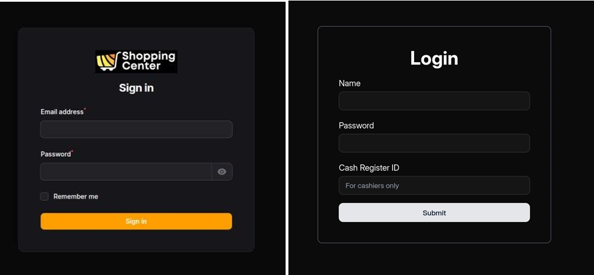
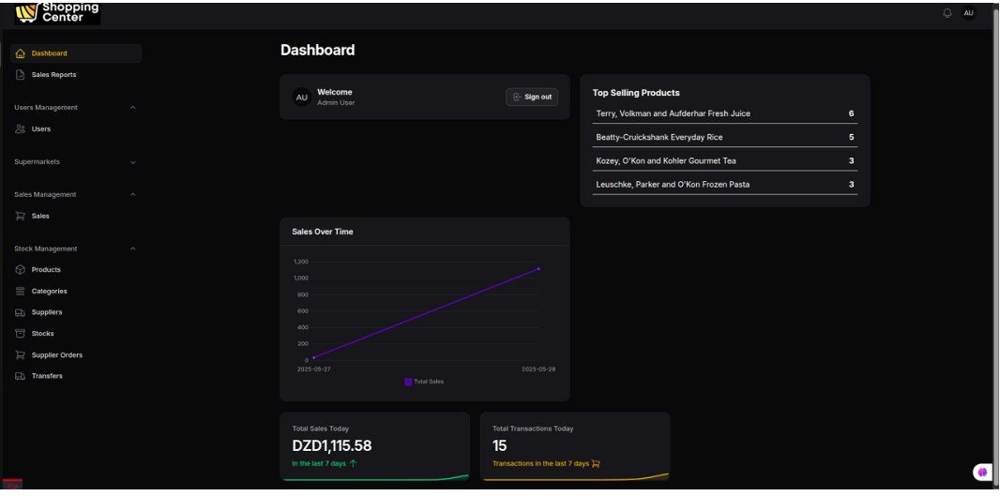
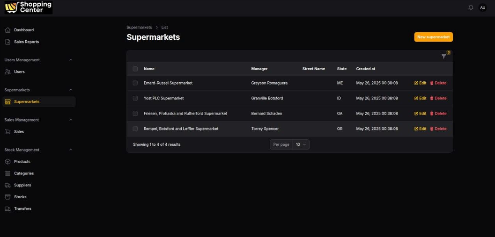
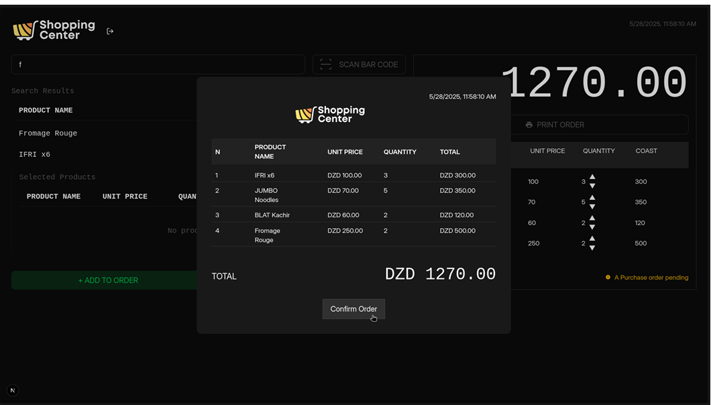
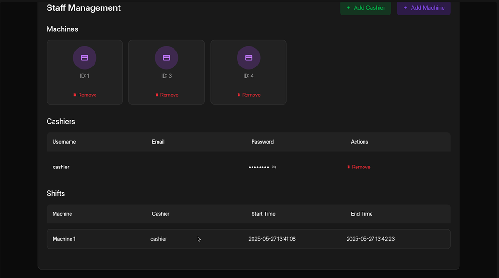
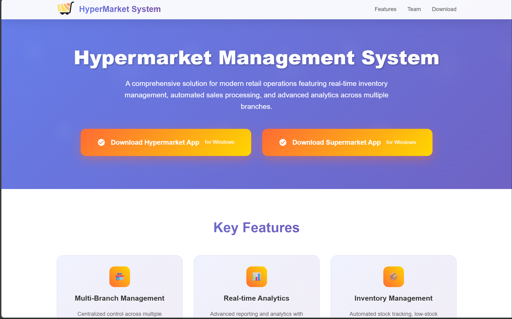
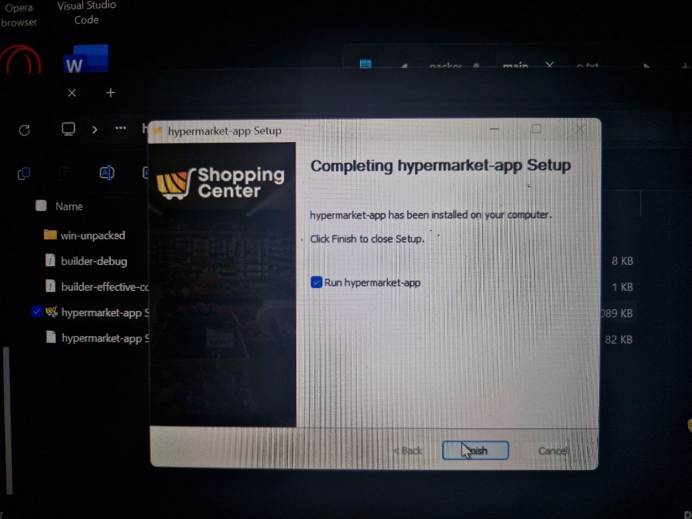
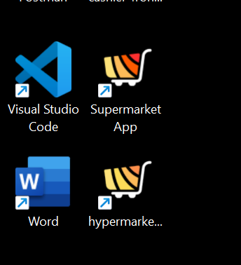

# 🛒 Hypermarket Shopping System

🔗 **Live Site**: [https://hepermarket-shopping.netlify.app/](https://hepermarket-shopping.netlify.app/)

📚 **This project was developed as part of our graduation project during the 2nd year of the  Engineer Degree in Computer Science.**

---

## 🔧 Source Code

- **Frontend**: [https://github.com/nerddude24/cashier-front](https://github.com/nerddude24/cashier-front)  
- **Backend**: [https://github.com/djasserdz/hypermarket-sales-management-system/tree/fucked](https://github.com/djasserdz/hypermarket-sales-management-system/tree/fucked)

---

## 👨‍💻 Developed By

- [@3boudi](https://github.com/3boudi)  
- [@indra100x](https://github.com/indra100x)  
- [@Sidali-Djeghbal](https://github.com/Sidali-Djeghbal)  
- [@djasserdz](https://github.com/djasserdz)  
- [@nerddude24](https://github.com/nerddude24)

---

## 📸 Screenshots
### 🔐 log-in pages (Hypermarket System+Supermarket System):
- 

### 🔐 Admin Dashboard (Hypermarket System)

- 
- 

### 🧾 Manager/Cashier Dashboard (Supermarket System)
- 
- 

### 🌐 Website Interface
- 

### 🖥️ Desktop Application
- 
- 
